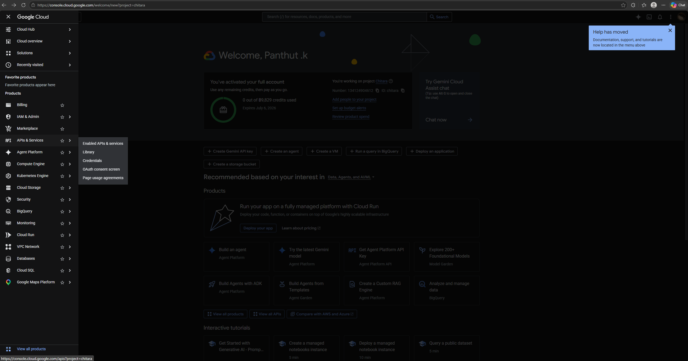
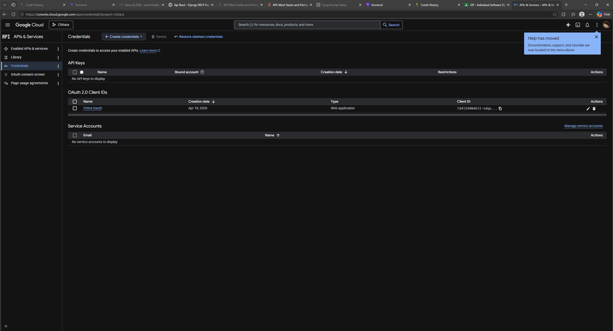
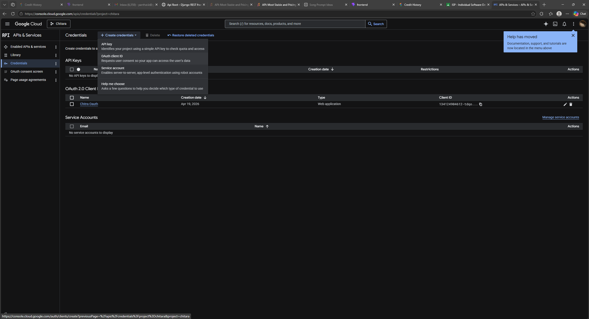

# Google OAuth 2.0 Setup Guide

This guide will walk you through setting up Google OAuth 2.0 so that users can log into Chithara AI Music Generator using their Google accounts.

## 1. Create a Google Cloud Project

1. Go to the [Google Cloud Console](https://console.cloud.google.com/).
2. Click on the project drop-down menu at the top of the screen and select **"New Project"**.
3. Name your project (e.g., `Chithara-Music-Gen`) and click **"Create"**.

## 2. Configure the OAuth Consent Screen & Select Scopes

Before creating credentials, you MUST configure the OAuth consent screen.

1. In the left sidebar, navigate to **APIs & Services** > **OAuth consent screen**.
2. Choose **External** and click **Create**.
3. Fill in the required fields:
   - **App name**: Chithara AI Music Generator
   - **User support email**: Your email address
   - **Developer contact information**: Your email address
4. Click **Save and Continue**.
5. **Scopes Screen**: Click **ADD OR REMOVE SCOPES**. You must select the following three standard scopes:
   - `.../auth/userinfo.email`
   - `.../auth/userinfo.profile`
   - `openid`
     Once checked, click **Update** at the bottom of the drawer, then click **Save and Continue**.
6. **Test Users Screen**: Skip adding test users. Click **Save and Continue**.
7. On the OAuth consent screen Dashboard, click **PUBLISH APP** to move it to "In production", allowing anyone to test without needing their email whitelisted!

## 3. Create OAuth Credentials

1. In the left sidebar, navigate to **APIs & Services** > **Enabled APIs & Services**

   
2. Choose Credential then  select blue top left Create Credential > OAuth client ID

   

   
3. Under **Application type it a drop box**, select **Web application**.
4. Name the client (e.g., `Chithara Web Client`).
5. Under **Authorized JavaScript origins**, click **+ ADD URI** and enter exactly:

   - `http://localhost:7999`
   - [`http://127.0.0.1:7999`](http://127.0.0.1:7999)
   - [`http://localhost:8000`](http://localhost:8000)
   - [`http://127.0.0.1:8000`](http://127.0.0.1:8000)
6. Under **Authorized redirect URIs**, click **+ ADD URI** and enter exactly:

   - [`http://localhost:8000/api/auth/google/callback/`](http://localhost:8000/api/auth/google/callback/)
   - [`http://127.0.0.1:8000/api/auth/google/callback/`](http://127.0.0.1:8000/api/auth/google/callback/)
7. Click **Create**.

## 4. Get Your Keys

1. A modal will pop up displaying your **Client ID** and **Client Secret**.
2. Copy these two values.

## 5. Add Keys to Your Project

1. Open the `.env` file inside the `backend/` directory of your project (create it if it doesn't exist).
2. Add the keys exactly like this:

```env
GOOGLE_CLIENT_ID=your-client-id-here
GOOGLE_CLIENT_SECRET=your-client-secret-here
```

## 6. Restart Server

Restart your Django backend server, and Google Login will now be fully functional!
