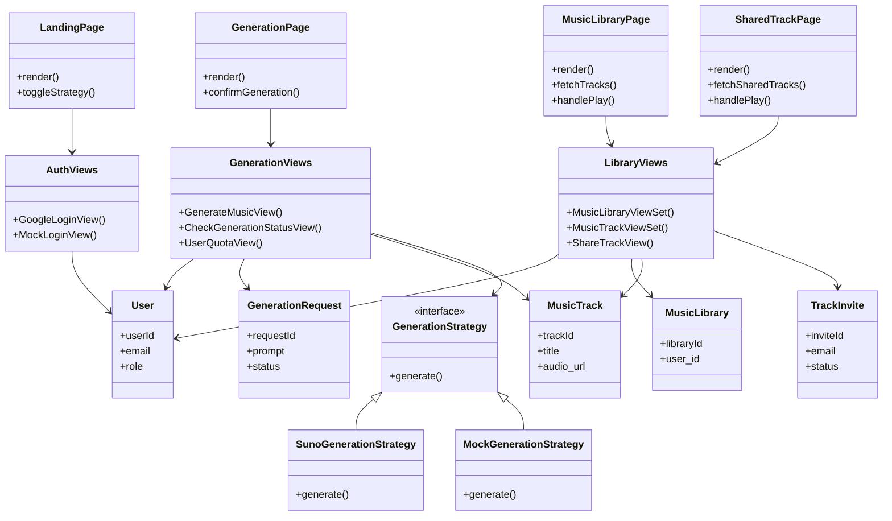
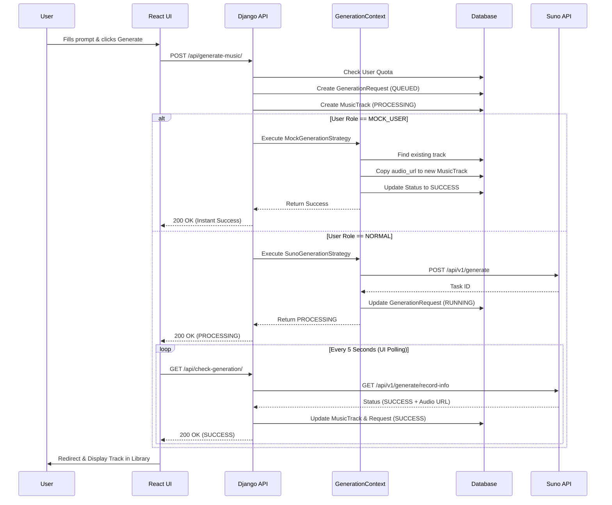

# Chithara-AI-music-generator

This project is part of 0129243-65 Principle of Software Design

**Presentation Video:** [https://youtu.be/7ccoewW8Ph4](https://youtu.be/7ccoewW8Ph4)

## Key Features

- **Google OAuth 2.0 Authentication**: Secure login flow with single-session enforcement via JWT and database tracking.
- **AI Music Generation**: Users can request custom tracks by specifying prompts, genres, and vocal styles. Requests are managed via a backend queue.
- **Preview & Confirmation**: A pre-generation modal to review track details before starting the AI engine.
- **Personal Music Library**: A dynamic interface to view, search, and sort generated tracks with high-fidelity UI components.
- **Custom Audio Player**: Feature-rich web audio player supporting background playback, volume control, skipping, track shuffling, and looping.
- **Security & Quotas**: Backend API rate limiting restricts generation to 30 tracks per user over a rolling 7-day period to prevent abuse.
- **Live Quota Tracking & Alerts**: The UI tracks your remaining generation coins in real-time and gracefully displays custom bottom-right toast notifications if you run out of credits (bypassing ugly browser alerts).
- **Strategy Pattern Architecture**: Generation logic is abstracted behind a `GenerationStrategy` interface, allowing dynamic runtime switching between actual Suno API generations and cost-free Mock generations without restarting the server or modifying `.env` flags.
- **Track Management**: Rename or completely remove tracks from your personal or shared library.

## System Architecture

The project follows a decoupled, layered architecture separating the React frontend (Presentation), Django views (Controllers), Strategy logic, and Database Models.

### Class Architecture Diagram



### Generation Sequence Diagram



## Testing & Grading (Mock Strategy)

To test the system without spending API credits, a secret **Mock UI Bypass** is implemented using the Strategy Pattern.

1. On the Landing Page, click the small grey `Strategy: SUNO` text in the top-left navigation bar.
2. Confirm the custom modal to switch to `Strategy: MOCK`.
3. Click the standard "Login with Google" or "Sign up" button.
4. Instead of opening Google OAuth, a Mock Login modal will appear. Select either `special1@chitharamock.com` or `special2@chitharamock.com`.
5. These users are assigned the `MOCK_USER` role in the database. When they generate a track, the `MockGenerationStrategy` safely intercepts the request, copies an existing track from the database, and returns it instantly.

## Setup Instructions

> [!IMPORTANT]**Before running the project**, you MUST configure your environment variables. Please read the two dedicated setup guides included in the repository:
>
> - [Google OAuth 2.0 Setup Guide](GOOGLE_OAUTH_SETUP.md)
> - [Suno API Setup Guide](SUNO_API_SETUP.md)

### 1. Clone the Repository

Start by cloning the project repository to your local machine and navigating into it:

```bash
git clone https://github.com/Panthutk/Chithara-AI-music-generator.git
cd Chithara-AI-music-generator
```

### 2. Create a Virtual Environment

Navigate to the `backend` directory and create a virtual environment (`venv`) to isolate the project's dependencies.

```bash
cd backend
```

**On Windows:**

```cmd
python -m venv venv
venv\Scripts\activate
```

**On macOS/Linux:**

```bash
python3 -m venv venv
source venv/bin/activate
```

### 3. Install Dependencies

Install the required packages using `pip`. Ensure your virtual environment is active.

```bash
pip install -r requirements.txt
```

### 4. Database Setup & Migrations

> [!TIP]
> You **do not** need to manually run any database commands. Just start the server normally!

Instead, the database is generated automatically behind the scenes:

1. When you run the `python manage.py runserver` command, the system automatically runs the database migrations to build the necessary tables.
2. It then runs a script that automatically creates the required test accounts (`special1@chitharamock.com` and `special2@chitharamock.com`) along with some sample songs.

This ensures the mock generation system always works immediately after cloning the repository, without requiring any extra setup steps from you!

### 5. Create a Superuser

To access the Django admin interface, run the provided script to create a default admin account (Username: `admin`, Password: `admin`):

```bash
python create_superuser.py
```

Alternatively, you can create your own custom superuser:

```bash
python manage.py createsuperuser
```

### 6. Run the Development Servers

**Backend (Django):**

Start the Django development server (ensure you are in the `backend` directory with your virtual environment activated):

```bash
python manage.py runserver
```

**Frontend (React):**

Open a new terminal, navigate to the `frontend` directory, install the required packages (first time only), and start the Vite development server:

```bash
cd frontend
npm install
npm run dev
```

### 7. Route Endpoints (Localhost)

The Django REST Framework powers the backend. Here are the active custom and router endpoints available at `http://127.0.0.1:8000`:

#### Authentication Endpoints

```bash
POST /api/auth/google/          # Initiate Google OAuth login
POST /api/auth/google/callback/ # Handle Google OAuth callback & issue JWT
POST /api/auth/verify-session/  # Verify active JWT and session token
POST /api/auth/mock-login/      # Secret Mock Login bypass for grading
```

#### Music Generation Endpoints

```bash
POST /api/generate-music/       # Submit a new generation prompt (Suno/Mock)
GET  /api/check-generation/     # Poll generation status (requires request_id)
GET  /api/user-quota/           # Fetch user's remaining coins/quota
```

#### Social / Sharing Endpoints

```bash
PATCH  /api/tracks/<id>/share/          # Update visibility or send track invite
GET    /api/invites/pending/            # Fetch user's pending track invites
PATCH  /api/invites/<id>/respond/       # Accept or reject an invite
GET    /api/tracks/shared/              # Fetch tracks shared with the user
DELETE /api/tracks/<id>/shared/         # Remove a track from shared library
```

#### Standard CRUD Router

```bash
/api/users/                 - GET, POST, PUT, PATCH, DELETE
/api/libraries/             - GET, POST, PUT, PATCH, DELETE
/api/tracks/                - GET, POST, PUT, PATCH, DELETE (Soft-Delete)
/api/generation-requests/   - GET, POST, PUT, PATCH, DELETE
/api/track-invites/         - GET, POST, PUT, PATCH, DELETE
```

---

## Database Structure

### Soft Delete Architecture

> [!IMPORTANT]
> To ensure data integrity, this API strictly enforces a **Soft Delete** pattern.
>
> - **Music Tracks**: Deleting a track via `DELETE /api/tracks/<id>/` (or via the UI) intercepts the Django REST Framework's `destroy` method and updates the track's status to `HIDDEN` instead of hard-deleting the row from the database.
> - **Shared Tracks**: Removing a shared track from a user's library hits `DELETE /api/tracks/<id>/shared/`, which updates the associated `TrackInvite` status to `REMOVED`.
>
> Permanent hard deletion is disabled across user-facing endpoints.

The following tables describe the actual models used in the API.

### User

| Field             | Type           | Attributes  | Description                             |
| ----------------- | -------------- | ----------- | --------------------------------------- |
| `userId`        | AutoField      | Primary Key | Unique identifier for the user.         |
| `name`          | CharField(255) |             | Name of the user.                       |
| `email`         | EmailField     | Unique      | Email address of the user.              |
| `role`          | CharField(50)  |             | Role of the user in the system.         |
| `session_token` | CharField(255) | Null/Blank  | UUID tracking the active login session. |

### MusicLibrary

| Field         | Type          | Attributes   | Description                            |
| ------------- | ------------- | ------------ | -------------------------------------- |
| `libraryId` | AutoField     | Primary Key  | Unique identifier for the library.     |
| `user`      | OneToOneField | Cascade      | Foreign key referring to `User`.     |
| `createdAt` | DateTimeField | Auto Now Add | Date and time the library was created. |

### MusicTrack

| Field          | Type           | Attributes       | Description                                                |
| -------------- | -------------- | ---------------- | ---------------------------------------------------------- |
| `trackId`    | AutoField      | Primary Key      | Unique identifier for the track.                           |
| `title`      | CharField(255) |                  | Title of the music track.                                  |
| `genre`      | CharField(255) |                  | Style/Genre of the track.                                  |
| `status`     | CharField(50)  | Choices, Default | Generation status (AVAILABLE, PROCESSING, FAILED, HIDDEN). |
| `visibility` | CharField(50)  | Choices, Default | Access control (PRIVATE, PUBLIC).                          |
| `audio_url`  | URLField(1000) | Null/Blank       | URL link to the generated MP3 file.                        |
| `image_url`  | URLField(1000) | Null/Blank       | URL link to the generated cover image.                     |
| `user`       | ForeignKey     | Cascade          | Owner of the track.                                        |
| `library`    | ForeignKey     | Cascade          | The library this track belongs to.                         |

### GenerationRequest

| Field            | Type           | Attributes          | Description                                           |
| ---------------- | -------------- | ------------------- | ----------------------------------------------------- |
| `requestId`    | AutoField      | Primary Key         | Unique request identifier.                            |
| `prompt`       | TextField      |                     | The user's prompt text for generation.                |
| `title`        | CharField(255) | Null/Blank          | Requested title.                                      |
| `style`        | CharField(255) | Null/Blank          | Requested style/genre.                                |
| `negativeTags` | CharField(255) | Null/Blank          | Tags to avoid during generation.                      |
| `vocalGender`  | CharField(10)  | Null/Blank          | Male ('m') or Female ('f') vocals.                    |
| `status`       | CharField(50)  | Choices, Default    | Generation status (QUEUED, RUNNING, SUCCESS, FAILED). |
| `createdAt`    | DateTimeField  | Auto Now Add        | Request creation timestamp.                           |
| `suno_task_id` | CharField(255) | Null/Blank          | Reference ID from the Suno API.                       |
| `user`         | ForeignKey     | Cascade             | User who requested the generation.                    |
| `track`        | OneToOneField  | Cascade, Null/Blank | The generated Track associated with the request.      |

### TrackInvite

| Field             | Type          | Attributes          | Description                                    |
| ----------------- | ------------- | ------------------- | ---------------------------------------------- |
| `inviteId`      | AutoField     | Primary Key         | Unique invitation ID.                          |
| `track`         | ForeignKey    | Cascade             | The track being shared.                        |
| `inviter`       | ForeignKey    | Cascade             | User who sent the invite.                      |
| `invitee_email` | EmailField    |                     | The recipient's email address.                 |
| `invitee`       | ForeignKey    | Cascade, Null/Blank | Recipient user account (if registered).        |
| `status`        | CharField(50) | Choices, Default    | Status (PENDING, ACCEPTED, REJECTED, REMOVED). |
| `created_at`    | DateTimeField | Auto Now Add        | Timestamp of the sent invitation.              |

---

## Assessment Answers

**1. Does the student have a up-to-date domain model?**
Yes, there is a domain model provided in `ref_data/DomainDiagram.pdf` and `ref_data/DomainDiagram.txt`. It represents a high-level design. Some entities from the original domain model (like `SharePermission` and `EmailInvitation`) were merged into `TrackInvite` during implementation, and `ListeningActivity` was omitted.

**2. Does the student have a class diagram that synchronized with the code?**
Yes. A Mermaid class diagram is included directly in this `README.md` under the "Class Architecture Diagram" section. It accurately reflects the actual models, views, and strategy classes present in the codebase.

**3. Does the class diagram follow the (MVT) architecture?**
Yes. The class diagram separates concerns appropriately, showing the Model Layer (Django Models), Controller Layer (Django Views), and Presentation Layer (React Frontend, taking the place of Django Templates in a decoupled MVT architecture).

**4. Is there only one class per file?**
Yes. In the `backend/api/models/` directory, each Django model is defined in its own separate file.

**5. Are file names consistent with their corresponding class names?**
Yes. The file names follow `snake_case` conventions that perfectly match their `PascalCase` class equivalents (e.g., `user.py` -> `User`, `music_track.py` -> `MusicTrack`, `generation_request.py` -> `GenerationRequest`).

**6. Is there a sequence diagram for the song generation use case?**
Yes. There is a Mermaid sequence diagram in this `README.md` under the "Generation Sequence Diagram" section detailing the interactions between the User, Frontend, Backend, Strategy Pattern, Database, and Suno API.

**7. Do the model classes follow the domain model?**
Mostly, yes. The core entities (`User`, `MusicLibrary`, `MusicTrack`, `GenerationRequest`) directly map to the domain model. However, for practical implementation reasons, `EmailInvitation` and `SharePermission` were consolidated into the `TrackInvite` model, and `ListeningActivity` is not tracked in the current database schema.

**8. How complete is the application?**
The application is highly complete and fully functional. It includes working Google OAuth authentication, actual AI music generation integrated with the Suno API, a quota system, track sharing/invitations, a custom React audio player, and a strategy pattern implementation to allow mock generation testing without consuming real API credits.
